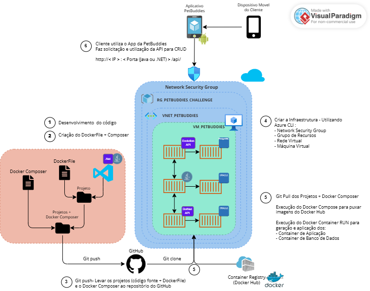

# PetBuddies — DevOps Tools e Cloud Computing | FIAP Challenge 2026

> Conteinerização em Azure VM — Java Advanced & .NET Advanced Business Development

## Equipe

| Nome | RM |
|------|----|
| Felipe Yuiti Ishii | 565339 |
| Gabriel Nogueira Peixoto | 563925 |
| Giovanna Neri dos Santos | 566154 |
| Mariana Inoue | 565834 |

---

## Descrição do Projeto

PetBuddies é uma plataforma de cuidado veterinário contínuo. O sistema combina um bot WhatsApp inteligente, um motor de personalização de planos preventivos por animal e uma API clínica que registra histórico, consultas e procedimentos.

O tutor conversa com o bot pelo WhatsApp para cadastrar o pet, agendar consultas, disparar triagem clínica ou consultar o plano de cuidado preventivo. Por trás da conversa, dois serviços colaboram em containers: o **Java** gerencia a lógica conversacional e o motor de cuidado; o **.NET** gerencia o domínio clínico (clínicas, veterinários, janelas de atendimento e prontuários).

Toda a plataforma roda em Docker sobre uma VM Linux na Azure — provisionada, configurada e inicializada por um único script Azure CLI.

---

## Benefícios para o Negócio

- **Acompanhamento preventivo automatizado** — o motor gera planos de cuidado individualizados por animal e mantém eventos preventivos (vacinações, vermifugações, exames) com datas calculadas automaticamente.
- **Triagem digital** — quatro perguntas clínicas calculam um score de risco que classifica o pet como `PODE_ESPERAR`, `PRIORITÁRIO` ou `EMERGÊNCIA`, reduzindo sobrecargas na recepção.
- **Canal WhatsApp sem instalação** — o tutor usa um app que já tem, sem necessidade de download de aplicativo adicional.
- **Histórico centralizado** — consultas, prontuários, procedimentos e registros de atendimento ficam em um único banco Oracle com estrutura relacional.
- **Infraestrutura reprodutível** — um script Azure CLI recria toda a infraestrutura do zero em minutos, sem configuração manual da VM.

---

## Arquitetura Macro



---

## Portas e Serviços

| Serviço | Container | Porta externa | Tecnologia |
|---------|-----------|:-------------:|------------|
| Motor Java + Bot WhatsApp | `petbuddies_java` | `8080` | Spring Boot 3.4 / Spring AI 1.1 |
| API Clínica .NET | `petbuddies_net` | `5000` | ASP.NET Core 8 / EF Core 8 |
| WhatsApp Gateway | `evolution_api` | `8081` | Evolution API v2.3.7 |
| Banco Oracle | `petbuddies_oracle` | interno | Oracle XE 21 (gvenzl/oracle-xe) |
| Banco Evolution | `evolution_postgres` | interno | PostgreSQL 15 |

---

## Rotas — CRUD Java (Protocolo)

Base URL: `http://<IP>:8080`  
Swagger: `http://<IP>:8080/swagger-ui.html`

| Método | Rota | Descrição |
|--------|------|-----------|
| `POST` | `/api/protocolos` | Cria protocolo de cuidado |
| `GET` | `/api/protocolos` | Lista todos os protocolos |
| `GET` | `/api/protocolos/{id}` | Busca protocolo por ID |
| `GET` | `/api/protocolos/buscar?categoria=&especie=` | Filtro parametrizado |
| `PUT` | `/api/protocolos/{id}` | Atualiza protocolo |
| `DELETE` | `/api/protocolos/{id}` | Remove protocolo |
| `POST` | `/api/protocolos/{id}/eventos` | Adiciona evento ao protocolo |
| `GET` | `/api/protocolos/{id}/eventos` | Lista eventos do protocolo |
| `GET` | `/api/eventos-protocolo/{id}` | Busca evento por ID |
| `PUT` | `/api/eventos-protocolo/{id}` | Atualiza evento |
| `DELETE` | `/api/eventos-protocolo/{id}` | Remove evento |

### Valores válidos dos enums

Todos os campos enum são enviados como **string** no JSON. Valores inválidos retornam `400 Bad Request`.

**Protocolo** (`POST /api/protocolos`):

| Campo | Obrigatório | Valores aceitos |
|-------|:-----------:|-----------------|
| `categoria` | sim | `PREVENTIVO` · `POS_CIRURGICO` |
| `especie` | sim | `CACHORRO` · `GATO` · `PASSARO` · `COELHO` · `HAMSTER` · `OUTRO` |
| `porte` | não | `MINI` · `PEQUENO` · `MEDIO` · `GRANDE` · `GIGANTE` |
| `sexo` | não | `MACHO` · `FEMEA` |

**Evento de Protocolo** (`POST /api/protocolos/{id}/eventos`):

| Campo | Obrigatório | Valores aceitos |
|-------|:-----------:|-----------------|
| `tipo` | sim | `VACINACAO` · `VERMIFUGACAO` · `EXAME` · `RETORNO` · `CIRURGIA` |
| `diasAposInicio` | sim | inteiro (dias a partir do início do protocolo) |

---

## Rotas — CRUD .NET

Base URL: `http://<IP>:5000`  
Swagger: `http://<IP>:5000/swagger`

### Endereço — pré-requisito obrigatório

> **Criar o endereço antes de qualquer clínica.** A clínica possui FK obrigatória para endereço — POST em `/api/clinica` sem um `enderecoId` válido retorna erro.
>
> CEP: 8 dígitos sem traço. Estado: 2 letras.

| Método | Rota | Descrição |
|--------|------|-----------|
| `POST` | `/api/endereco` | Cria endereço |
| `GET` | `/api/endereco` | Lista endereços |
| `GET` | `/api/endereco/{id}` | Busca endereço por ID |
| `PUT` | `/api/endereco/{id}` | Atualiza endereço |
| `DELETE` | `/api/endereco/{id}` | Remove endereço |

### Clínica

> CNPJ: 14 dígitos sem pontuação.

| Método | Rota | Descrição |
|--------|------|-----------|
| `POST` | `/api/clinica` | Cria clínica |
| `GET` | `/api/clinica` | Lista clínicas |
| `GET` | `/api/clinica/{id}` | Busca clínica por ID |
| `GET` | `/api/clinica/buscar?nome=` | Busca clínica por nome |
| `PUT` | `/api/clinica/{id}` | Atualiza clínica |
| `DELETE` | `/api/clinica/{id}` | Remove clínica |

---

## Dockerfile e Docker Compose

- [`petbuddies-ai/Dockerfile`](petbuddies-ai/Dockerfile) — multi-stage, Alpine, usuário não-root `petbuddies`, expõe `:8080`
- [`PetBuddies-API/Dockerfile`](PetBuddies-API/Dockerfile) — multi-stage, usuário não-root `appuser`, expõe `:80`
- [`docker-compose.yml`](docker-compose.yml) — 5 serviços com healthchecks, volumes nomeados e variáveis por `.env`

### Volumes nomeados

```yaml
volumes:
  oracle_data:              # persiste dados do Oracle XE
  evolution_postgres_data:  # persiste dados do PostgreSQL (Evolution)
  evolution_instances:      # persiste instâncias WhatsApp da Evolution
```

---

## Script Azure CLI

[`azure-deploy.sh`](azure-deploy.sh)

O script executa em sequência, sem intervenção manual:

1. Cria resource group `petbuddies-rg` em `mexicocentral`
2. Provisiona VM Ubuntu 22.04 `Standard_D2ds_v4` (2 vCPUs / 8 GB) com usuário `petbuddies` (sem privilégios root)
3. Abre portas 22, 8080, 5000 e 8081 no NSG
4. Instala Docker, Git, curl e nano na VM via `az vm run-command`

Ao final exibe o IP público e os próximos passos para clonar o repositório e subir os containers via SSH.

---

## How To — Execução Local

**Pré-requisito:** Docker Desktop instalado e rodando.

```bash
# 1. Clonar o repositório
git clone https://github.com/3BugBuddies/PetBuddies-Devops.git
cd PetBuddies-Devops

# 2. Configurar variáveis de ambiente
cp .env.example .env
# Editar .env e preencher:
#   ORACLE_ROOT_PASSWORD, ORACLE_APP_USER, ORACLE_APP_PASSWORD
#   ORACLE_USER (mesmo valor que ORACLE_APP_USER)
#   GEMINI_API_KEY
#   POSTGRES_USER, POSTGRES_PASSWORD

# 3. Subir todos os containers em background
docker compose up -d --build

# 4. Aguardar Oracle XE ficar healthy (~5 min no primeiro start)
docker compose ps

# 5. Acessar
# Java Swagger:  http://localhost:8080/swagger-ui.html
# .NET Swagger:  http://localhost:5000/swagger
# Evolution API: http://localhost:8081
```

---

## How To — Deploy na Azure

**Pré-requisito:** Azure CLI instalado e logado (`az login`).

```bash
# 1. Rodar o script — provisiona VM, abre portas e instala Docker + Git
bash azure-deploy.sh
# O script exibe o IP público ao final.

# 2. SSH na VM (senha definida no script: PetBuddies@2026)
ssh petbuddies@<IP_VM>

# 3. Clonar o repositório e configurar variáveis
git clone https://github.com/3BugBuddies/PetBuddies-Devops.git petbuddies
cd petbuddies
cp .env.example .env
nano .env   # preencher: ORACLE_ROOT_PASSWORD, ORACLE_APP_USER, ORACLE_APP_PASSWORD,
            #            ORACLE_USER, GEMINI_API_KEY, POSTGRES_USER, POSTGRES_PASSWORD

# 4. Subir todos os containers em background
docker compose up -d --build

# 5. Verificar status (aguardar Oracle XE healthy — ~5 min no primeiro start)
docker compose ps

# 6. Testar externamente (no terminal local):
curl http://<IP_VM>:8080/api/protocolos
curl http://<IP_VM>:5000/api/clinica
```

---

## Encerrando — Remoção da VM

> **Obrigatório ao final da entrega** — a VM gera custo enquanto ativa.

```bash
az group delete --name petbuddies-rg --yes --no-wait
```

Aguardar a exclusão no portal Azure e capturar o print como evidência para o PDF final.
