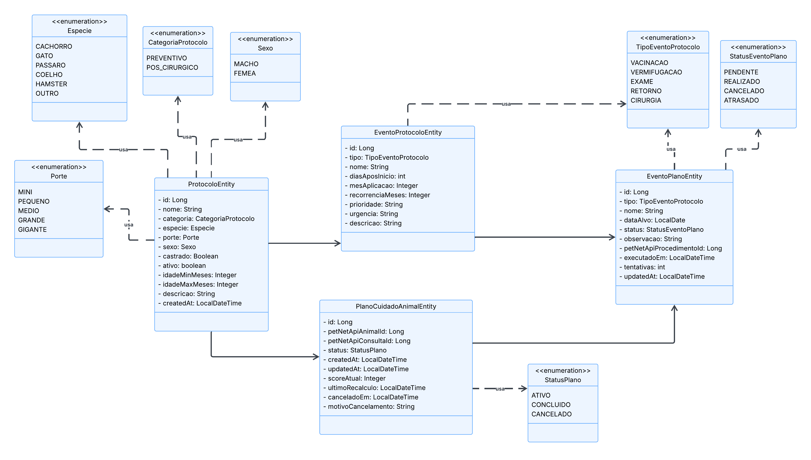
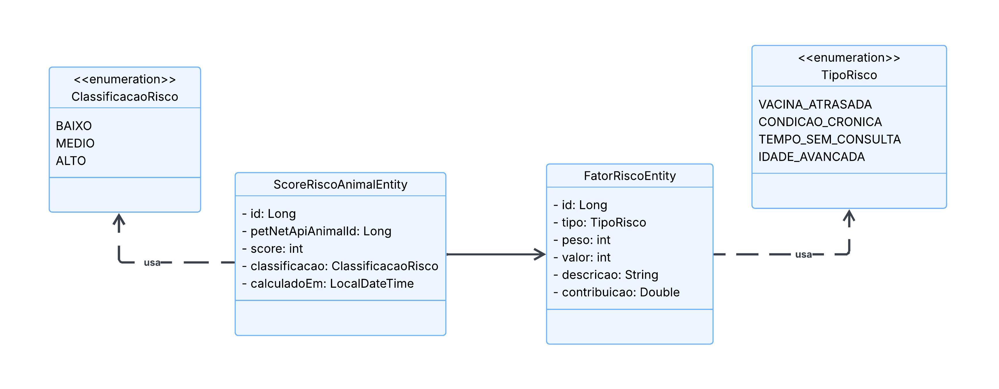
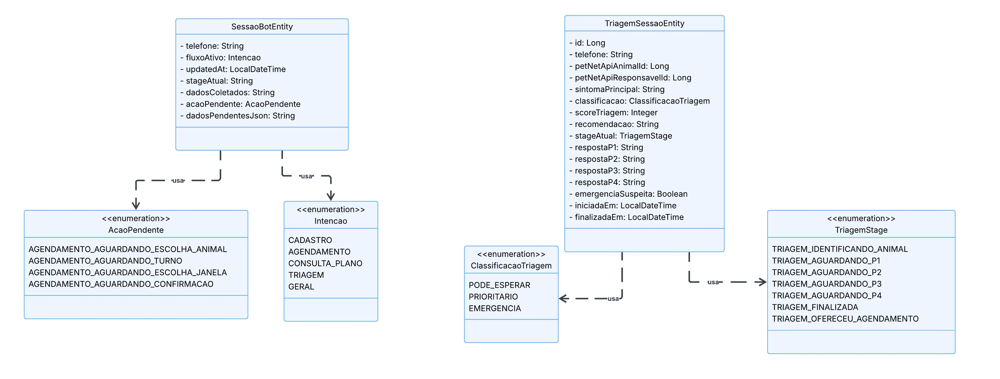

# PetBuddies AI — Challenge FIAP 2026 | Java Advanced

Bot WhatsApp + Motor de cuidado contínuo para pets desenvolvido com Spring Boot e Spring AI, como parte do Challenge da disciplina de **Java Advanced (2TDSR)** — FIAP 2026.

O serviço recebe mensagens via Evolution API, classifica a intenção do tutor (cadastro, agendamento, triagem, consulta ao plano preventivo), executa chamadas ao Gemini 2.5 Flash e responde pelo WhatsApp. O motor de personalização de cuidado para cada pet mantém planos preventivos, eventos e scores de risco por animal.

---
## Integrantes do Grupo

| Nome | RM |
|------|----|
| Felipe Yuiti Ishii | 565339 |
| Gabriel Nogueira Peixoto | 563925 |
| Giovanna Neri dos Santos | 566154 |
| Mariana Inoue | 565834 |

---

## Configuração — Spring Initializr

### Dependências

| Dependência | Categoria | Descrição |
|-------------|-----------|-----------|
| Spring Web | WEB | API REST + Webhook |
| Spring Data JPA | SQL | 8 entidades JPA (motor + conversação bot) |
| Oracle Driver | SQL | Oracle FIAP |
| Spring AI OpenAI | AI | Gemini via endpoint OpenAI-compatible |
| Spring AI JDBC Memory | AI | Memória de conversa persistida |
| Bean Validation | I/O | Validação de DTOs |
| Springdoc OpenAPI | Dev | Swagger UI único com tags ordenadas por domínio |


---

## Avaliação Java — roteiro de endpoints de Protocolo

> Estes endpoints são **autocontidos**: As Entidades Protocolo e EventoProtocolo não dependem da API .NET nem do WhatsApp. O avaliador precisa apenas do `Petbuddies-AI` rodando com Oracle FIAP configurado.

### Contexto dos recursos testados

O catálogo de protocolos é a parte administrativa do motor de cuidado. Ele guarda as regras que dizem qual plano o sistema deve gerar para cada animal e quais ações esse plano deve conter.

- **Protocolo** é um modelo de cuidado. Exemplo: um protocolo preventivo para cachorro filhote ou um protocolo pós-cirúrgico para gato. Ele define a categoria (`PREVENTIVO` ou `POS_CIRURGICO`) e os critérios de aplicação, como espécie, porte, sexo, castração e faixa de idade.


- **Evento de protocolo** é uma ação prevista dentro desse modelo. Exemplo: vacinação, vermifugação, exame ou retorno. Cada evento informa quando deve acontecer em relação ao início do plano (`diasAposInicio`).


- Quando um animal é cadastrado na API .NET, o .NET chama o motor Java. O motor escolhe um protocolo compatível e transforma os eventos de protocolo em eventos reais do plano daquele animal.


- O bot usa esse motor indiretamente: o tutor conversa pelo WhatsApp, cadastra o animal, consulta o plano e recebe respostas baseadas nesses protocolos e eventos.


- Por isso esta seção pode ser testada isoladamente: ela valida a base de regras do motor sem depender do WhatsApp, da Evolution API ou da API .NET.

### Fluxo sugerido

| Ordem | No projeto | Método | Rota | Retorno esperado |
|---|---|---|---|---|
| 1 | Cadastra um novo modelo de cuidado | `POST` | `/api/protocolos` | `201` com o protocolo criado |
| 2 | Mostra os modelos de cuidado disponíveis para o motor | `GET` | `/api/protocolos` | `200` com lista de protocolos ativos |
| 3 | Localiza protocolos usados em planos preventivos | `GET` | `/api/protocolos/buscar?categoria=PREVENTIVO` | `200` com protocolos da categoria |
| 4 | Simula a seleção de regra para um perfil de animal | `GET` | `/api/protocolos/buscar?categoria=PREVENTIVO&especie=CACHORRO` | `200` com filtro combinado |
| 5 | Consulta um modelo específico | `GET` | `/api/protocolos/{id}` | `200` com o protocolo |
| 6 | Ajusta uma regra de cuidado já cadastrada | `PUT` | `/api/protocolos/{id}` | `200` com dados atualizados |
| 7 | Adiciona uma ação planejada ao modelo | `POST` | `/api/protocolos/{protocoloId}/eventos` | `201` com o evento criado |
| 8 | Mostra a sequência de cuidado do protocolo | `GET` | `/api/protocolos/{protocoloId}/eventos` | `200` com eventos ordenados por `diasAposInicio` |
| 9 | Isola ações de um tipo dentro do plano | `GET` | `/api/protocolos/{protocoloId}/eventos?tipo=VACINACAO` | `200` com eventos filtrados |
| 10 | Consulta uma ação planejada específica | `GET` | `/api/eventos-protocolo/{id}` | `200` com o evento |
| 11 | Ajusta prazo ou descrição de uma ação planejada | `PUT` | `/api/eventos-protocolo/{id}` | `200` com evento atualizado |
| 12 | Remove uma ação do modelo | `DELETE` | `/api/eventos-protocolo/{id}` | `204` sem corpo |
| 13 | Remove um modelo de cuidado de teste | `DELETE` | `/api/protocolos/{id}` | `204` sem corpo |

O `POST` de evento de protocolo é `POST /api/protocolos/{protocoloId}/eventos`, e não `POST /api/eventos-protocolo`, porque o evento é filho de um protocolo. Ele só faz sentido vinculado ao modelo de cuidado que depois será usado pelo motor para gerar eventos reais no plano de um animal.

### Validações e respostas de erro

| Situação | Método | Rota | Retorno esperado |
|---|---|---|---|
| Tenta criar protocolo sem campos obrigatórios | `POST` | `/api/protocolos` com `{}` | `400` com `ErrorDto` |
| Busca protocolo inexistente | `GET` | `/api/protocolos/999999` | `404` com `ErrorDto` |
| Tenta criar evento sem tipo, nome ou prazo | `POST` | `/api/protocolos/{protocoloId}/eventos` com `{}` | `400` com `ErrorDto` |
| Tenta criar evento com enum inválido | `POST` | `/api/protocolos/{protocoloId}/eventos` com `"tipo": "VACINA"` | `400` com valores aceitos |
| Busca evento inexistente | `GET` | `/api/eventos-protocolo/999999` | `404` com `ErrorDto` |

---

## Estrutura do Projeto

```
petbuddies-ai/
├── assets/
├── docs/
│   └── postman/
│       └── petbuddies-ai-java.postman_collection.json
├── src/main/java/br/com/fiap/petbuddies/
│   ├── client/        # PetNetApiClient
│   ├── config/        # ChatClientConfig, PetNetApiClientConfig, OpenApiConfig
│   ├── controller/
│   │   ├── bot/       # WebhookController, SimulationController
│   │   ├── motor/     # MotorPlanoController, MotorScoreController
│   │   └── protocolo/ # ProtocoloController, EventoProtocoloController
│   ├── domain/
│   │   ├── entity/    # 8 entidades JPA
│   │   ├── enums/     # 14 enums de domínio
│   │   └── repository/# 8 repositórios Spring Data
│   ├── dto/
│   │   ├── bot/       # DTOs conversação
│   │   ├── client/    # DTOs integração .NET
│   │   ├── evolution/ # EvolutionWebhookDTO
│   │   ├── motor/     # DTOs motor de cuidado
│   │   └── protocolo/ # DTOs catálogo
│   ├── exception/     # Exceções de domínio
│   ├── flow/          # Orquestração fluxos conversacionais
│   │   └── dto/       # DTOs de estado dos fluxos
│   ├── handler/       # GlobalExceptionHandler
│   └── service/
│       ├── bot/       # ChatService, ClassificadorService, RedatorService, ...
│       ├── motor/     # MotorPlanoService, MotorScoreService, ...
│       └── protocolo/ # ProtocoloService, EventoProtocoloService
├── .env.example
├── Dockerfile
└── README.md
```


## Por que Repository e não DAO?

O Spring Data JPA já gerencia o `EntityManager` automaticamente — ciclo de vida, transações, thread-safety. O `JpaRepository` entrega o CRUD pronto via interface, sem precisar implementar nada na mão.

DAO faria sentido se precisássemos de controle fino sobre o `EntityManager`. Aqui, o Spring cuida disso melhor do que faríamos manualmente.

---

## Modelo de Dados

### Motor Core — 6 entidades

Tabelas Independentes - Sem vinculo com .NET

| Entidade | Tabela | Relacionamentos |
|----------|--------|-----------------|
| `ProtocoloEntity` | `T_PB_PROTOCOLO` | 1:N → EventoProtocoloEntity |
| `EventoProtocoloEntity` | `T_PB_EVENTO_PROTOCOLO` | N:1 → ProtocoloEntity |

Tabelas Dependentes - Com vinculo com .NET

| Entidade | Tabela | Relacionamentos | Vínculo .NET |
|----------|--------|-----------------|--------------|
| `PlanoCuidadoAnimalEntity` | `T_PB_PLANO_CUIDADO_ANIMAL` | N:1 → ProtocoloEntity; 1:N → EventoPlanoEntity | `T_PB_ANIMAL`, `T_PB_CONSULTA` |
| `EventoPlanoEntity` | `T_PB_EVENTO_PLANO` | N:1 → PlanoCuidadoAnimalEntity | `T_PB_PROCEDIMENTO` |
| `ScoreRiscoAnimalEntity` | `T_PB_SCORE_RISCO_ANIMAL` | 1:N → FatorRiscoEntity | `T_PB_ANIMAL` |

Tabelas Dependentes de tabelas relacionadas ao .NET

| Entidade | Tabela | Relacionamentos |
|----------|--------|-----------------|
| `FatorRiscoEntity` | `T_PB_FATOR_RISCO` | N:1 → ScoreRiscoAnimalEntity |

**Diagrama 1 — Catálogo e Plano de Cuidado**
Relacionamentos entre `ProtocoloEntity`, `EventoProtocoloEntity`, `PlanoCuidadoAnimalEntity` e `EventoPlanoEntity`, com os enums de domínio associados.



**Diagrama 2 — Score de Risco**
Estrutura de cálculo de risco: `ScoreRiscoAnimalEntity` agrega múltiplos `FatorRiscoEntity`, cada um com tipo, peso e valor individual.



### Conversação Bot — 2 entidades

| Entidade | Tabela | Relacionamentos | Vínculo .NET |
|----------|--------|-----------------|--------------|
| `SessaoBotEntity` | `T_PB_SESSAO_BOT` | — | — |
| `TriagemSessaoEntity` | `T_PB_TRIAGEM_SESSAO` | — | `T_PB_ANIMAL`, `T_PB_RESPONSAVEL` |

**Diagrama 3 — Sessão Conversacional e Triagem**
`SessaoBotEntity` gerencia o estado do fluxo ativo por telefone. `TriagemSessaoEntity` registra as respostas às 4 perguntas clínicas e o score calculado.



### Enums

| Enum | Valores |
|------|---------|
| `Especie` | `CACHORRO`, `GATO`, `PASSARO`, `COELHO`, `HAMSTER`, `OUTRO` |
| `Porte` | `MINI`, `PEQUENO`, `MEDIO`, `GRANDE`, `GIGANTE` |
| `Sexo` | `MACHO`, `FEMEA` |
| `CategoriaProtocolo` | `PREVENTIVO`, `POS_CIRURGICO` |
| `StatusPlano` | `ATIVO`, `CONCLUIDO`, `CANCELADO` |
| `TipoEventoProtocolo` | `VACINACAO`, `VERMIFUGACAO`, `EXAME`, `RETORNO`, `CIRURGIA` |
| `StatusEventoPlano` | `PENDENTE`, `REALIZADO`, `CANCELADO`, `ATRASADO` |
| `TipoRisco` | `VACINA_ATRASADA`, `CONDICAO_CRONICA`, `TEMPO_SEM_CONSULTA`, `IDADE_AVANCADA` |
| `ClassificacaoRisco` | `BAIXO`, `MEDIO`, `ALTO` |
| `Intencao` | `CADASTRO`, `AGENDAMENTO`, `CONSULTA_PLANO`, `TRIAGEM`, `GERAL` |
| `ClassificacaoTriagem` | `PODE_ESPERAR`, `PRIORITARIO`, `EMERGENCIA` |
| `TriagemStage` | `TRIAGEM_IDENTIFICANDO_ANIMAL`, `TRIAGEM_AGUARDANDO_P1`, `TRIAGEM_AGUARDANDO_P2`, `TRIAGEM_AGUARDANDO_P3`, `TRIAGEM_AGUARDANDO_P4`, `TRIAGEM_FINALIZADA`, `TRIAGEM_OFERECEU_AGENDAMENTO` |
| `AcaoPendente` | `AGENDAMENTO_AGUARDANDO_ESCOLHA_ANIMAL`, `AGENDAMENTO_AGUARDANDO_TURNO`, `AGENDAMENTO_AGUARDANDO_ESCOLHA_JANELA`, `AGENDAMENTO_AGUARDANDO_CONFIRMACAO` |
| `CadastroStage` | `CADASTRO_IDENTIFICANDO_TUTOR`, `CADASTRO_AGUARDANDO_NOME_TUTOR`, `CADASTRO_COLETANDO_ANIMAL`, `CADASTRO_AGUARDANDO_CONFIRMACAO`, `CADASTRO_FINALIZADO` |


---

## Arquitetura Conversacional

```
Mensagem WhatsApp
      │
      ▼
ClassificadorService          ← Gemini sem memória, retorna Intencao + confiança
      │
      ▼
ChatService                   ← roteia por intenção e comanda globais (ajuda, cancelar)
      │
      ├── TriagemFlowService       (fluxo determinístico — 4 perguntas + score)
      ├── AgendamentoFlowService   (fluxo determinístico — janelas + confirmação)
      ├── CadastroFlowService      (fluxo determinístico — coleta dados tutor/pet)
      └── ConsultaPlanoFlowService (consulta plano ativo + eventos do pet)
            │
            ▼
      PetNetApiClient          ← chamadas HTTP reais para petbuddies-api (.NET)
            │
            ▼
      RedatorService           ← Gemini formata resposta em linguagem natural
            │
            ▼
      EvolutionService         ← envia resposta para o WhatsApp
```

**Intenções suportadas:** `CADASTRO`, `AGENDAMENTO`, `CONSULTA_PLANO`, `TRIAGEM`, `GERAL`

**FlowSessaoHelper** serializa e recupera o estado do fluxo (Dados*Pendente) na `SessaoBotEntity` entre mensagens, usando Jackson.

---


## Como Executar

### Pré-requisitos

- Java 21+
- Maven 3.9+
- Acesso ao Oracle FIAP (VPN ou rede local)
- Chave Gemini API (`GEMINI_API_KEY`)
- Evolution API rodando (Docker) — opcional para testar endpoints REST isolados
- `petbuddies-api` (.NET) rodando em `http://localhost:5297` — opcional para testar o bot

## Configuração do Banco de Dados

Oracle disponibilizado pela FIAP. Copie `.env.example` para `.env` e preencha as credenciais:

```env
ORACLE_URL=jdbc:oracle:thin:@oracle.fiap.com.br:1521/ORCL
ORACLE_USER=             # seu RM (ex: rm123456)
ORACLE_PASSWORD=         # sua senha Oracle FIAP
```

> Preencha `ORACLE_USER` com seu RM e `ORACLE_PASSWORD` com a senha do Oracle FIAP.

O Hibernate gerencia o schema automaticamente via `ddl-auto=update` — as tabelas são criadas ou atualizadas no startup sem necessidade de migrations manuais.

---


### Rodando localmente

```bash
# Clonar o repositório
git clone https://github.com/3BugBuddies/PetBuddies-AI
cd petbuddies-ai

# Configurar credenciais
cp .env.example .env
# preencher ORACLE_USER, ORACLE_PASSWORD, GEMINI_API_KEY e EVOLUTION_API_KEY no .env

# Executar
mvn spring-boot:run -Dspring-boot.run.profiles=dev
```

A aplicação sobe em:
- **Swagger UI:** `http://localhost:8080/swagger-ui.html`

### Variáveis de ambiente completas

```env
GEMINI_API_KEY=          # chave da Google AI Studio
ORACLE_URL=jdbc:oracle:thin:@oracle.fiap.com.br:1521/ORCL
ORACLE_USER=             # usuário Oracle FIAP (RM)
ORACLE_PASSWORD=         # senha Oracle FIAP
EVOLUTION_API_URL=http://localhost:8081
EVOLUTION_API_KEY=       # chave da instância Evolution
EVOLUTION_API_INSTANCE=petbuddies
```

> O profile `dev` aponta para `petbuddies-api` em `http://localhost:5297`. O profile `docker` usa `http://petbuddies-net:5000`.

## Tecnologias Utilizadas

- **Java 21** / Spring Boot 3.4.5
- **Spring AI 1.1.6** — tool calling + memória JDBC
- **Gemini 2.5 Flash** via endpoint OpenAI-compatible
- **Spring Data JPA + Hibernate** — 8 entidades Oracle
- **Oracle Database** (FIAP)
- **Springdoc OpenAPI 2.8.8** (Swagger UI)
- **Bean Validation** (Jakarta)
- **Evolution API** — gateway WhatsApp
